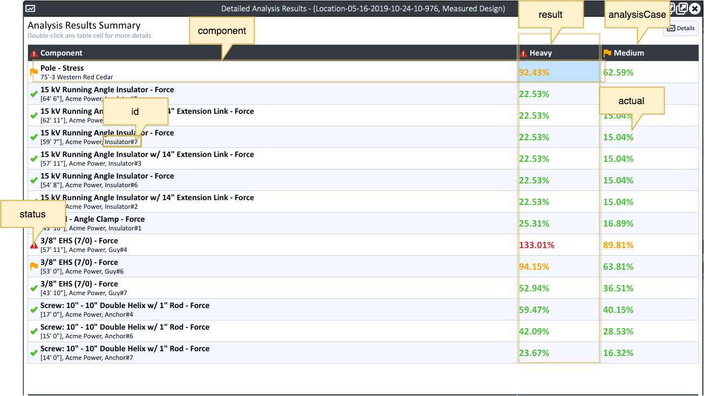

SPIDACalc Analysis Results
==========================

This document is to highlight the most important fields for reporting on results. It does not document all result features. For more detailed information please look at the relevant schema files.

SPIDAcalc stores results in two different formats.

[**Detailed Results**](../resources/schema/spidacalc/results/results.schema) Are returned by SPIDAcee, and are also stored in the results folder of a full SPIDAexchange zip file.

[**Analysis Assets**](../resources/schema/spidamin/asset/standard_details/analysis_asset.schema) are included in the SPIDAcalc Exchange project JSON and contain limited summary information about loading.

These share some field names/meanings, but the structure is slightly different.

## Detailed Results

Each Result in **Results** contains the analysis results for a single analysis case. The singular [**Result**](../resources/schema/spidacalc/results/result.schema) object is what is returned from SPIDAcee.

Important Fields:

- **analysisCase** - Name of the load or strength case
- **messages** - Any warnings or errors from this analysis.
- **components** - List of results for each component on the pole. 



### Component

The [Component](../resources/schema/spidacalc/results/component.schema) is the detailed version of the **Analysis Asset**. It contains the loading result for that specific component.

Important Fields:

- **id** - The id of the component in the structure. e.g. "Pole" or "Insulator#4" - matches "id" in the Analysis Asset.
- **actual** - The loading percentage or safety factor of that component under that analysis case at the worst wind direction.
- **allowable** - The loading percentage or safety factor at which this component will fail.
- **status** - If the analysis passed, failed, or was near failing. Some components can fail for reasons other than a high loading percentage. ```status != FAILING``` is equivalent to **passes** in the Analysis Asset.
- **resultsType** - PERCENT or SAFETY_FACTOR. Equivalent to **unit** in the Analysis Asset.
- **actualEngineering** - The calculated force, moment, stress, etc on the component.
- **allowableEngineering** - The force, moment, stress, etc that will cause the component to fail.
- **windDirection** - The wind direction that caused this worst case loading.
- **atDirection** - The results that were found at the other wind directions analyzed. All of these will be the same or lower than the reported result.
- **atHeight** - The loading values at intervals along the pole.
- **ratio** - normalizes safety factor and loading percentage results.
- **failingRatio** - The ratio at which the component fails.
- **message** - Additional information about results (for example, in the case of an analysis that did not converge)
- **poles**, **wires**, **anchors**, etc. - The calculated values for each component on the structure that generated this analysis. This is where, for example, you could find the tension used for wires.
- **additionalValues** - Any values specific to a type of analysis. For example, strength analysis will report the remaining section modulus here. A push brace reports whether it was in tension here.


## Analysis Asset
The summary results containing analysis assets are found under the **design.analysis** in the SPIDAcalc project JSON. Each entry under **analysis** corresponds to a **Load Case** or **Strength Case** name. The **results** array under each **analysis** contains a list of results for that load case per component.

If a project contains only analysis assets, when they are loaded into SPIDAcalc the analysis will be marked as not current.

Important fields:

- **component** - The id of the component in the structure. e.g. "Pole" or "Insulator#4"
- **actual** - The loading percentage or safety factor of that component under that analysis case.
- **allowable** - The loading percentage or safety factor at which this component will fail.
- **passes** - If the analysis passed. Some components can fail for reasons other than a high loading percentage.
- **unit** - PERCENT or SAFETY_FACTOR
- **loadInfo** - The name of the Load or Strength Case (same as **analysis.id**)

